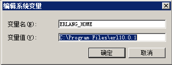
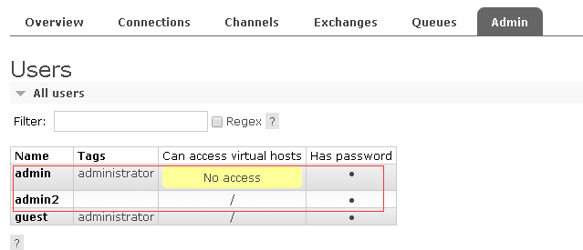

# 准备文件
  + otp_win64_21.0.1.exe
  + rabbitmq-server-3.7.17.exe
  + rabbitmq依赖Erlang语言作为环境语言otp_win64，不同的rabbitmq版本依赖的otp_win64版本也不同，对应的上即可
  
# 安装otp_win64_21.0.1.exe
# 环境变量的安装与验证
  + 安装完成之后创建一个名为ERLANG_HOME的系统变量，其值指向erlang的安装目录
  + 同时将%ERLANG_HOME%\bin加入到Path中，最后打开命令行，输入erl，如果出现erlang的版本信息就表示erlang语言环境安装成功；
  + 注意：ERLANG_HOME的指向目录是bin的上级目录
  + erlang_home配置：
  

# 安装rabbitmq-server-3.7.17.exe
  + 注意，rabbitmq的默认安装目录是系统盘的Program file文件夹，但是rabbitmq其内部设置是不允许文件夹有中文，有空格的，加之功能也不适合在系统盘中，需要另外选择目录进行安装!
  + 比如安装路径是D:\RabbitMQServer

# 开启插件
  + 使用cmd或者powershell进入sbin目录，比如D:\RabbitMQServer\rabbitmq_server-3.7.17\sbin
  + 运行下面几个命令
      + `./rabbitmq-plugins enable rabbitmq_management`
      + `./rabbitmq-plugins enable rabbitmq_web_stomp`
      + `./rabbitmq-plugins enable rabbitmq_web_stomp_examples`
# 重启服务
  打开服务管理器，找到RabbitMQ服务，重启服务
# 添加帐号
  + 浏览器打开管理后台http://localhost:15672，
  + guest guest 登录，添加一个用户用于代码连接mq,我建的是admin2 admin2，分配虚拟主机 '/'给该用户
  + 由于guest不能外网登陆管理系统，所以需要再添加一个外网管理账号 admin admin，分配Admin标签给该账号
  