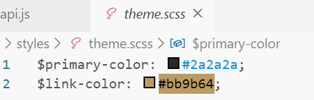
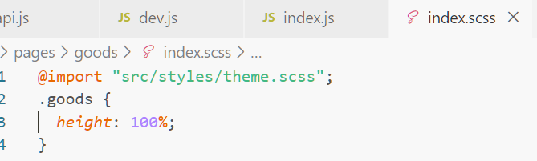
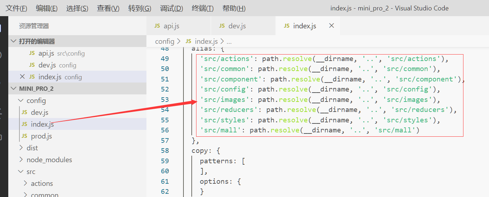

# css方面
  1. 尽量用flex布局
  2. 使用scss
  3. 使用统一的主题参数
    
    
  4. 在psd设计文件里，字体只取文字颜色和大小两个参数即可，行高跟字体大小一样
  5.  边框注意使用大写的PX，别的话用小写px，后面会转换成rpx
# js方面
  1.  可以使用一些别名配置路径来简化import，就可以用绝对路径引用文件了
  
  2. rander方法会频繁渲染，所以里面尽量不能有代码逻辑，否则会影响运行速度
  3. 要影响到子控件的布局，在本页面加上这个参数
  static options = {
      addGlobalClass: true
    }
